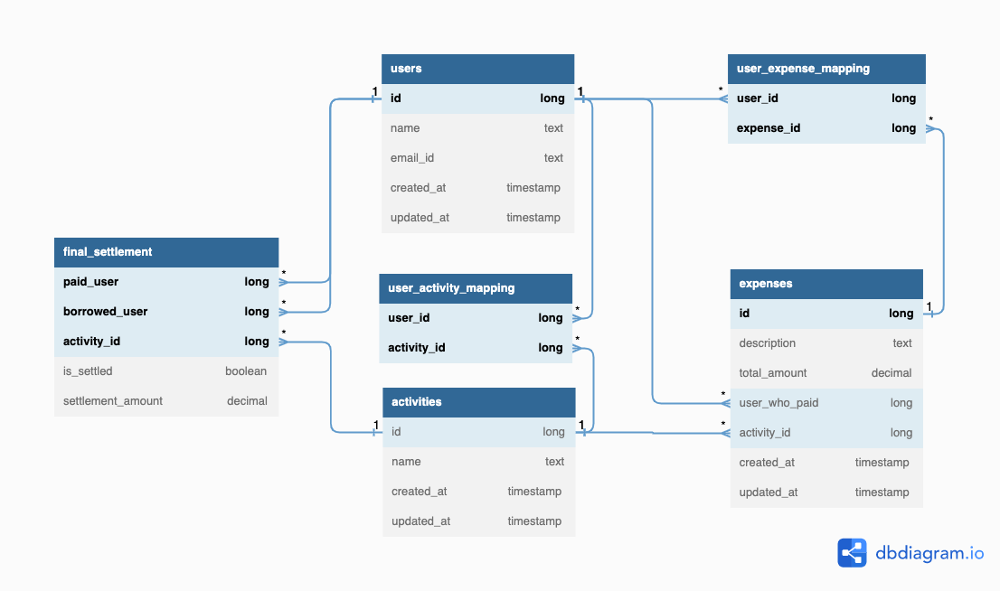

# Splitwise Solution

### Assumptions:

1. User signup/login flow is assumed out of the scope.
2. Signup/login will expect user to provide email/mobile number.
3. Uniqueness of the user will be validated based on email/mobile number.
4. There is no role based responsibility within an activity, anyone part of the activity can add or remove user/expense.
5. Authentication and Authorisation is also assumed out of the scope.
6. Expense can’t be added without any user associated with it.
7. Notifying the users on new activity or expense is assumed out of the scope.
8. Payment of an expense is also considered out of the scope.
9. Amount will be split equally on all the mentioned users [No partial percentage].

### Use cases Covered:

1. As a user, I should be able to add activity with zero or more users.
2. As a user, I should be able to add/remove user’s to an activity.
3. As a user, I should be able to add expense along with the users involved in it.
4. As a user, I should be able to generate the final settlement amount for each pair of users.
5. As a user, I should be able to complete the settlement with other users.
6. As a user, I should be able to list all the activity that I got involved
7. As a user, I should be able to list all expenses in a given activity
8. As a user, I should be able to list all settlements done for the given activity

### Database Schema design

